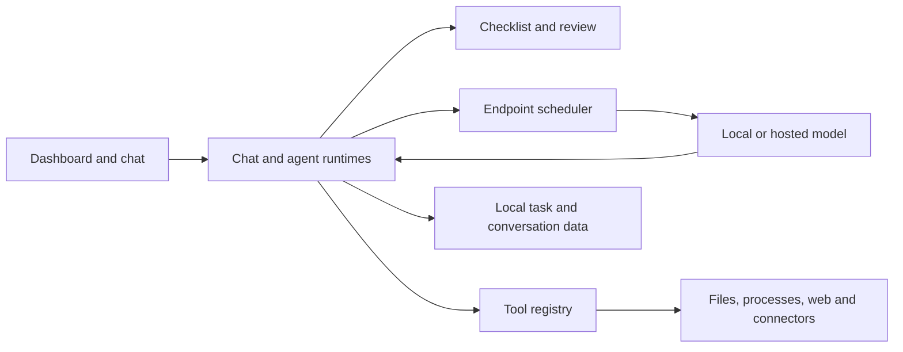

# Velox

**A high-productivity agentic harness for long-running work.**

Velox is designed for flash-grade frontier models such as GLM 5.3 Flash and DeepSeek V4 Flash. It addresses their shortcomings on longer jobs with persistent requirements, context management and separate review, keeping track of unfinished work and checking results before accepting them.

Start with a rough idea or a detailed specification. Velox breaks the request into tractable steps, works through them progressively, and verifies the result against the original requirements. It is particularly good at taking an ambiguous initial prompt and developing it into a complete project without needing instructions for every step.

The dashboard shows progress across many running agents at a glance. You can follow several jobs without repeatedly opening each conversation and reconstructing what happened. That reduces the context switching and fatigue of supervising agents, while keeping the details available when you need to intervene.

Velox has built substantial, multi-component software projects unattended from a single prompt, including writing and running the code, fixing failures and testing the result. Research, writing, analysis and scheduled work use the same task and tool system.

## What it does

- **Checklists and review.** Requirements and implementation steps stay with the task throughout a run. A separate Reviewer checks the submitted work. Requirements that fail review remain open for further work.
- **Tools and delegation.** Agents can read and edit files, run Python and shell commands, use persistent terminals, research the web and inspect images. Background agents can work on parts of a larger task and return their results. Tool access is selected per chat; Reviewers have a restricted tool set.
- **Long-running execution.** Context fitting and compaction keep model requests within their budgets. Recorded tool results preserve completed work, and endpoint recovery handles transient failures. Requests, tool output, progress and token usage remain inspectable.
- **Working context.** Calendar items, Context Docs, reusable Skills and scheduled tasks support ongoing work. Optional Google Calendar, Google Drive, Gmail and Slack connections bring in account context. Models can run locally or through hosted endpoints.

## Run it

Use Python 3.13. Windows is the primary interactive environment; the regression suite also runs headlessly on Linux.

From the repository in PowerShell:

```powershell
py -3.13 -m venv .venv
.\.venv\Scripts\python.exe -m pip install -r requirements.txt

$python = (Resolve-Path .\.venv\Scripts\python.exe).Path
$app = (Resolve-Path .\velox.py).Path

New-Item -ItemType Directory -Force ..\velox-data | Out-Null
Set-Location ..\velox-data
& $python $app
```

The working directory is the data directory. Keep it separate from the source checkout and use a fresh directory for the first run. The current build uses `v303` data files and does not migrate older schemas. Add `--init-only` to create the data files without opening the window.

The interface uses [PySDL3](https://pysdl3.readthedocs.io/en/latest/install.html), with Pillow for images. Other integrations have optional dependencies you can install as needed.

## First task

Open **Settings** and configure an endpoint's URL, model name and API key where required. Bundled profiles provide starting settings. A local server must be running, and the model must support the selected tool-calling API.

Create a chat, enable the tools it needs, and point it at a disposable workspace. For example:

> Build me a local tool for exploring CSV files. I want to drop in a file, understand what is in it, filter it, and export useful subsets. Pick a sensible stack. Make it solid enough to use. Add tests and run them.

A longer brief works too. Include specific requirements, source material and constraints when you have them. Velox uses those to plan the work and check the outcome.

Follow progress on the dashboard and open the task to inspect its checklist or tool output. **Pause** holds work at a safe boundary. **Stop** cancels the active task.

Tools run with your account's permissions. Read [SECURITY.md](SECURITY.md) before giving them access to important files or private accounts.

## How it works



The application is in [velox.py](velox.py), with tests in [test_velox.py](test_velox.py).

`ChatRuntime` and `AgentRuntime` handle task execution. `LLMClient` handles model requests, and `EndpointInferenceScheduler` controls endpoint concurrency. Inference slots are released during tool work and pauses. `ToolRegistry` provides the native tools; `ChecklistStore` and `_tool_verify_checklist` handle requirements and review. `Panels` contains the interface.

## Tests

The suite contains **2,063 regression tests** covering model transports, tools, persistence, agents, checklists, UI behavior and cancellation.

From the repository root, using your environment's Python:

```bash
python test_velox.py
```

Headless tests need Pillow and `tzdata`. They use temporary data and local provider fixtures. Each test class runs in its own disposable child process with a timeout. Set `VELOX_TEST_RUNNER_TRACE=1` to print per-shard startup/body/cleanup timing. To run one class:

```bash
python test_velox.py --test-class TransportDeadlineTests
```

[GitHub Actions](.github/workflows/tests.yml) runs the same suite on Windows and Linux for pushes and pull requests.

## License

[MIT](LICENSE).
