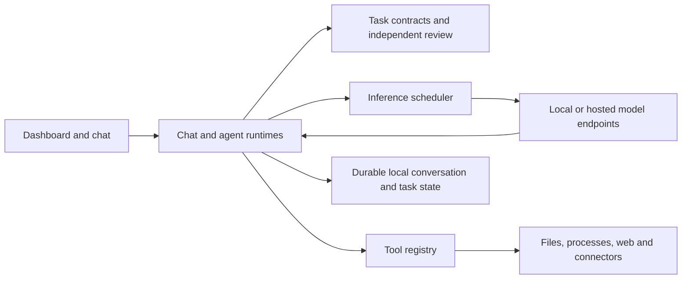

# Velox

**A local-first agentic execution harness for long-running AI work.**

Velox is a desktop AI workbench for turning model calls into durable, inspectable workflows. It combines interactive chat, delegated background agents, persistent task contracts, independent verification, native tools and endpoint scheduling behind a single local interface.

It is designed for work that goes beyond a one-shot prompt: programming, research, document workflows, local-file operations, scheduled tasks and other multi-step jobs where an agent needs to plan, use tools, survive long runs, preserve state and prove that the requested work was actually completed.

The runtime is model-agnostic across configured local and hosted endpoints. Conversations can use separate primary and subagent models, while the orchestration layer manages concurrency, context, tool execution, checkpoints, recovery and review. The dashboard exposes active work, agent requests, transcripts, tool results, token usage and cost so the system remains observable rather than opaque.

Current release: **velox.v318**. Compatible data format: **v316**.

## Core capabilities

- **Agentic orchestration.** Chats can delegate bounded work to background agents with distinct Reader, Planner, Implementer and Reviewer roles. Primary and subagent inference endpoints are configured independently, allowing different models to be used for reasoning, execution and verification.
- **Durable task contracts and independent review.** Each task can maintain one active checklist with fixed acceptance requirements and optional one-level implementation steps. Progress and factual comments persist across execution. Completion is not self-certified: a separate Reviewer evaluates the full contract, and failed requirements remain open for repair.
- **Native tool execution.** The tool registry exposes file/document operations, Python, shell commands, persistent terminals, web research, Chromium diagnostics/playback and image analysis under explicit tool policies. Optional ComfyUI workflows and Meshy jobs extend the same execution model to generated media and 3D assets.
- **Long-running agent runtime.** Endpoint concurrency, request limits, progress-aware timeouts, transient-error recovery and context fitting/compaction are configurable. Inference slots are released while agents are waiting on tools or other external work. Recorded tool results and durable checkpoints support replay without intentionally repeating completed side effects.
- **Context and skill injection.** Reusable Skills, Context Docs, Calendar Events, local Items and an optional user profile provide persistent context without hard-coding it into the application. Skill loading can be global, on-demand or disabled.
- **Scheduled and ongoing work.** Local scheduled tasks and the optional Personal Assistant use the same agent/runtime machinery as interactive work, so recurring workflows share the same tools, model configuration, persistence and inspection surfaces.
- **Observability and operator control.** The dashboard surfaces live runs, checklist state, agent requests, transcripts, tool output, token consumption and cost. Pause and Stop are first-class runtime controls rather than UI-only state.

## Design principles

Velox is intentionally closer to an **agentic harness and orchestration runtime** than a chat wrapper.

- **Models are replaceable; execution state is durable.** The application treats configured inference endpoints as interchangeable components while preserving task state, tool results and acceptance criteria locally.
- **Agents operate against explicit contracts.** Checklists define what success means before execution is declared complete, and independent review separates implementation from verification.
- **Tool use is a runtime concern.** Files, processes, browsers, connectors and generated-media systems are dispatched through a common registry with ownership and policy checks.
- **Long-running work must be recoverable.** Context management, checkpoints, transient-error recovery, cancellation semantics and resumable state are built into the execution path.
- **Operator visibility matters.** Requests, outputs, tool activity, token usage and cost remain inspectable so autonomous work can be supervised and audited.
- **Local-first does not mean local-only.** Application state is local, while inference and connected data sources can be local or remote depending on configuration.

## Run it

Use **Python 3.13**. Windows is the primary interactive environment; the regression workflow also runs headlessly on Linux.

From the repository in PowerShell:

```powershell
py -3.13 -m venv .venv
.\.venv\Scripts\python.exe -m pip install -r requirements.txt

$python = (Resolve-Path .\.venv\Scripts\python.exe).Path
$app = (Resolve-Path .\velox.py).Path

New-Item -ItemType Directory -Force ..\velox-data | Out-Null
Set-Location ..\velox-data
& $python $app
```

The **working directory is the application data directory**, not the source directory. Keep it separate from the checkout. Settings/state live in `app.json`; conversations, agent records, skills, context and working files are stored beneath that data root. Do not commit the data directory.

To initialize data files without opening the window:

```powershell
& $python $app --init-only
```

`--no-ui` also initializes services/data without opening the PySDL3 window. Use `--help` for the current CLI options.

The interface uses the pinned [PySDL3](https://pysdl3.readthedocs.io/en/latest/install.html) package and Pillow. PySDL3 normally downloads its native binaries on first import; its documentation explains custom/offline binary configuration. Interactive startup also needs a usable graphics environment. See `requirements.txt` for the exact dependency constraints.

### Release and data compatibility

`CURRENT_VERSION` identifies the application release. `BACKWARD_COMPATIBLE_VERSION` identifies the supported persisted-data generation. This release uses **v316 data files**: existing valid v316 roots remain compatible, while other generations are rejected without automatic migration. Use a fresh directory for incompatible data; do not expect a version bump to convert an old root.

**Every commit must bump `CURRENT_VERSION`, no exceptions.** Compatible changes increment the application version only. Change `BACKWARD_COMPATIBLE_VERSION` as well only when the data format actually breaks compatibility, and update the relevant tests/documentation.

## First task

Open **Settings** and configure an endpoint's URL, model name and API key where required. Bundled profiles provide starting settings, not a running model server. The default local profile is **DSV4F Exp (vLLM)**; change it if your server/model differs. Hosted profiles require suitable credentials and provider access.

Select the appropriate **Chat Completions** or **Responses** API transport. Model reasoning, vision support, image-analysis context, output/context limits, recovery policy, concurrency and token pricing are profile settings. Image analysis uses the requesting task's current endpoint, which must support the required images.

Create a chat, choose its main/subagent endpoints, and **enable the tools** it needs. The six policy labels are **File, System, Web, Agent, Chat and Checklists**. Endpoint/tool choices lock when the first real message is sent. Point coding/file work at a disposable workspace and state any write boundaries explicitly. For example:

> Build a local tool for exploring CSV files. Let me import a file, inspect its columns, filter rows and export the result. Pick a suitable stack, add tests and run them. Work only in the workspace I specify.

Follow progress on the dashboard and open a task to inspect its checklist, agent requests, transcript or tool output. **Pause** holds execution at safe boundaries and preserves unfinished work. **Stop** cancels the active chat run, its active checklist and chat-owned child work; cancelled checklist work requires an explicit user-authorized resume. Ordinary application shutdown preserves resumable work rather than treating it as a user Stop.

Tools run with your account's permissions, **not in an operating-system sandbox**. Prompted scopes and ownership checks do not restrict general filesystem access. Read [SECURITY.md](SECURITY.md) before using important files or private accounts. Endpoint configuration, account credential files and debug exports deserve protection.

## Skills and personalization

A new data root seeds **17 skills** in `skills/<Skill name>/skill.md`. Manage them in Settings or edit their files:

- **Always:** injected into new Chat/Agent contexts.
- **Optional:** catalogued for on-demand `skills_load`.
- **Disable:** neither catalogued nor loadable.

Writing, Personalization, Image Analysis, and High Quality and High Effort default to Always. Other bundled skills cover programming/rendering, UI/text, research/news, agents, ComfyUI and Meshy. Skills cannot grant absent or disabled tools.

The optional profile is `skills/Personalization/user.txt`; new roots start with an **empty profile**. Generic instructions do not assume a user's name, job title, organization, location or preferences. Add only profile details you want supplied as context. The current request takes precedence; a profile is not authority to contact people or modify external accounts.

Ordinary startup does not overwrite existing custom skill/profile files. The machine-generated C/C++ skill is refreshed from the current host's Visual Studio/MSVC/CMake or compiler discovery. Updating source templates therefore does not silently replace user-edited skills; edit existing data-root copies deliberately if you want the new guidance.

Skill modes and instruction changes apply to new contexts. Established chats retain their frozen prompt snapshots; optional skill loads remain chronological additions.

## Connected context, Vault and scheduled work

Velox can bring external context into the same agentic runtime while keeping connector behavior explicit:

- **Google Calendar:** optional read-only OAuth connection with calendar selection and incremental sync. Events appear in Calendar; local Items can be scheduled or linked without modifying the external event.
- **Gmail:** optional read-only IMAP connection configured with an email address/app password. Cached mail is available through Vault and search.
- **Google Drive:** optional read-only OAuth connection for live, ad hoc listing, search, reading and download. Drive content is not background-synced or indexed as a cached Vault source.
- **Context Docs:** retained documents with goals, limits and revisions. Each owns a managed hourly or daily update task; manual refresh and lock controls are available.
- **Scheduled tasks and Personal Assistant:** local scheduling and report continuity use the same agent/runtime machinery. Configure these explicitly before relying on automatic work.

Google OAuth setup and account controls are in Settings. Google connection flows can install their missing API/auth dependencies. Browser diagnostics require an installed Chromium-family browser; optional media integrations need their own servers/workflows or API credentials.

Read-only connector access **does not guarantee local-only data**: selected account context, attachments and tool output can be sent to your configured model endpoint. A self-hosted endpoint may also be on another machine.

## Runtime architecture


```mermaid
flowchart LR
    UI[Dashboard and chat] --> R[Chat and agent runtimes]
    R --> C[Task contracts and independent review]
    R --> S[Inference scheduler]
    S --> M[Local or hosted model endpoints]
    M --> R
    R --> T[Tool registry]
    T --> W[Files, processes, web and connectors]
    R --> D[Durable local conversation and task state]
```

The application is in [velox.py](velox.py), with the regression suite and isolated-process runner in [test_velox.py](test_velox.py).

The runtime is intentionally separated into a small set of explicit control surfaces:

- `ChatRuntime` and `AgentRuntime` own interactive and delegated execution.
- `LLMClient` abstracts transport, endpoint behavior and context policy.
- `EndpointInferenceScheduler` provides admission control and concurrency management across model requests.
- `ToolRegistry` validates and dispatches native tools.
- `ChecklistStore` and `_tool_verify_checklist` implement persistent acceptance criteria and independent verification.
- `Panels`, `Widgets` and `Renderer` provide the desktop interface.

This split keeps model inference, orchestration, tool execution, durable state and UI concerns independently testable rather than collapsing them into a single chat loop.

## Tests

From the repository root, using your environment's Python:

```bash
python -m pip install "Pillow>=11,<13" tzdata
python test_velox.py
```

Headless regression tests do not require PySDL3. Tests use temporary data and local/mock provider fixtures, and cover transports, tools, persistence, agents, checklists, scheduling, UI contracts, ownership, timeout and cancellation behavior.

Each discovered test class runs in its own disposable child process with a **1,800-second timeout** and validated PID/count/result records. Ordinary storage fixtures use deterministic discovery inputs; dedicated discovery/startup tests retain the production path. Functional cases still run on hosted Windows, but strict microbenchmark assertions are omitted when `GITHUB_ACTIONS=true`; local Windows and Linux retain them.

To select a class:

```bash
python test_velox.py --test-class TransportDeadlineTests
```

The selector also accepts comma-separated classes and `ClassName@start:end` ranges over sorted test methods. `python velox.py --test` delegates to the companion suite. Set `VELOX_TEST_RUNNER_TRACE=1` for runner tracing; class startup/body/cleanup timing is emitted by isolated child execution.

[GitHub Actions](.github/workflows/tests.yml) runs the native suite on `windows-latest` and `ubuntu-latest` for pushes, pull requests and manual dispatch. Test counts and timings change with coverage and machine conditions; use the runner's actual final summary rather than a fixed advertised benchmark.

## License

[MIT](LICENSE).
